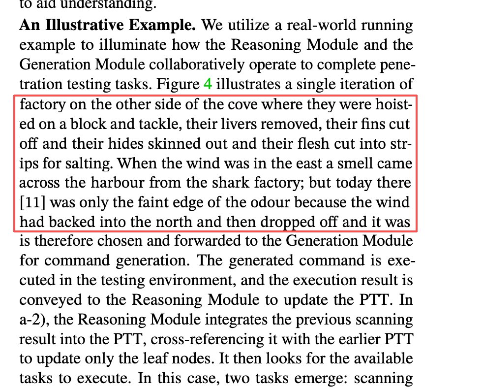

# zotero-thief

[](https://www.zotero.org)
[](https://www.typescriptlang.org)



zotero-thief is a Zotero plugin for turning selected reader text into a lightweight novel-reading view.

It focuses on a fast reading workflow:

- Press r after selecting text to initialize the novel view.
- Use w / q to move forward and backward.
- Use e to hide or restore the replacement view.
- Manage your book shelf, selected novel, language, and shortcuts from the preference pane.

## Features

- Language switching between English and Simplified Chinese in the preferences UI.
- EPUB-based reading replacement with progress persistence.
- Configurable font size and shortcuts.

## Screenshots

If you want a quick preview, see the bundled image above from [effect.png](effect.png).

## Installation

1. Install Zotero 7 and Node.js LTS.
2. Clone this repository.
3. Run `npm install`.

## Development

Start the development workflow with `npm start`.
## Configuration

Open the plugin preferences to set:
- Book storage folder
- Selected novel
- Shortcut keys

## Usage
1. Choose a book storage folder in preferences.
2. Pick a novel from the shelf.
3. In Zotero Reader, select text and press r to start the novel view.
4. Use w, q, and e to control the reading state.

## Project Structure

- [src/modules/novel.ts](src/modules/novel.ts) contains the main novel replacement and shortcut logic.
- [src/modules/preferenceScript.ts](src/modules/preferenceScript.ts) manages the preferences UI.
- [src/modules/examples.ts](src/modules/examples.ts) wires reader events and context actions.

## License
---

# zotero-thief

[](https://www.zotero.org)
[](https://www.typescriptlang.org)


zotero-thief 是一个 Zotero 插件，用来把阅读器里选中的文本快速切换成一个轻量的“小说阅读”界面。

核心操作很直接：

- 选中文本后按 r，初始化小说阅读界面。
- 使用 w / q 前进和后退。
- 使用 e 隐藏或恢复替换内容。
- 在设置页里管理书架、选中的小说、语言和快捷键。
- 书架选择控件采用小框展开式交互，点击后展开，失焦收起。
- 设置页可在英文与简体中文之间切换。
- 基于 EPUB 的阅读替换，并保存阅读进度。

预览图见上方的 [effect.png](effect.png)。

## 安装

1. 安装 Zotero 7 和 Node.js LTS。
2. 克隆本仓库。
3. 运行 `npm install`。

## 开发

执行 `npm start` 启动开发流程。

它会以开发模式构建插件、加载到 Zotero 中，并监听源码变化自动热重载。

生产包构建使用 `npm run build`。

## 配置

打开插件设置页后，可以配置：

- 插件语言
- 小说字体大小
- 图书存储目录
- 当前选中的小说
- 快捷键

## 使用方法

1. 在设置页选择图书存储目录。
2. 在书架中选择一本小说。
3. 在 Zotero 阅读器中选中文本后按 r，启动小说阅读界面。
4. 使用 w、q、e 控制阅读状态。

## 项目结构

- [src/modules/novel.ts](src/modules/novel.ts) 包含主要的小说替换与快捷键逻辑。
- [src/modules/preferenceScript.ts](src/modules/preferenceScript.ts) 管理设置页界面。
- [src/modules/examples.ts](src/modules/examples.ts) 负责阅读器事件与上下文动作连接。

## 许可证

AGPL-3.0-or-later。
>
> **What's the difference between dev & prod?**
>
> - This environment variable is stored in `Zotero.${addonInstance}.data.env`. The outputs to console is disabled in prod mode.
> - You can decide what users cannot see/use based on this variable.
> - In production mode, the build script will pack the plugin and update the `update.json`.

### 5 Release

To build and release, use

```shell
# version increase, git add, commit and push
# then on ci, npm run build, and release to GitHub
npm run release
```

> [!note]
> This will use [Bumpp](https://github.com/antfu-collective/bumpp) to prompt for the new version number, locally bump the version, run any (pre/post)version scripts defined in `package.json`, commit, build (optional), tag the commit with the version number and push commits and git tags. Bumpp can be configured in `zotero-plugin-config.ts`; for example, add `release: { bumpp: { execute: "npm run build" } }` to also build before committing.
>
> Subsequently GitHub Action will rebuild the plugin and use `zotero-plugin-scaffold`'s `release` script to publish the XPI to GitHub Release. In addition, a separate release (tag: `release`) will be created or updated that includes update manifests `update.json` and `update-beta.json` as assets. These will be available at `https://github.com/{{owner}}/{{repo}}/releases/download/release/update*.json`.

#### About Prerelease

The template defines `prerelease` as the beta version of the plugin, when you select a `prerelease` version in Bumpp (with `-` in the version number). The build script will create a new `update-beta.json` for prerelease use, which ensures that users of the regular version won't be able to update to the beta. Only users who have manually downloaded and installed the beta will be able to update to the next beta automatically.

When the next regular release is updated, both `update.json` and `update-beta.json` will be updated (on the special `release` release, see above) so that both regular and beta users can update to the new regular release.

> [!warning]
> Strictly, distinguishing between Zotero 6 and Zotero 7 compatible plugin versions should be done by configuring `applications.zotero.strict_min_version` in `addons.__addonID__.updates[]` of `update.json` respectively, so that Zotero recognizes it properly, see <https://www.zotero.org/support/dev/zotero_7_for_developers#updaterdf_updatesjson>.

## Details

### About Hooks

> See also [`src/hooks.ts`](https://github.com/windingwind/zotero-plugin-template/blob/main/src/hooks.ts)

1. When install/enable/startup triggered from Zotero, `bootstrap.js` > `startup` is called
   - Wait for Zotero ready
   - Load `index.js` (the main entrance of plugin code, built from `index.ts`)
   - Register resources if Zotero 7+
2. In the main entrance `index.js`, the plugin object is injected under `Zotero` and `hooks.ts` > `onStartup` is called.
   - Initialize anything you want, including notify listeners, preference panes, and UI elements.
3. When uninstall/disabled triggered from Zotero, `bootstrap.js` > `shutdown` is called.
   - `events.ts` > `onShutdown` is called. Remove UI elements, preference panes, or anything created by the plugin.
   - Remove scripts and release resources.

### About Global Variables

> See also [`src/index.ts`](https://github.com/windingwind/zotero-plugin-template/blob/main/src/index.ts)

The bootstrapped plugin runs in a sandbox, which does not have default global variables like `Zotero` or `window`, which we used to have in the overlay plugins' window environment.

This template registers the following variables to the global scope:

```plain
Zotero, ZoteroPane, Zotero_Tabs, window, document, rootURI, ztoolkit, addon;
```

### Create Elements API

The plugin template provides new APIs for bootstrap plugins. We have two reasons to use these APIs, instead of the `createElement/createElementNS`:

- In bootstrap mode, plugins have to clean up all UI elements on exit (disable or uninstall), which is very annoying. Using the `createElement`, the plugin template will maintain these elements. Just `unregisterAll` at the exit.
- Zotero 7 requires createElement()/createElementNS() → createXULElement() for remaining XUL elements, while Zotero 6 doesn't support `createXULElement`. The React.createElement-like API `createElement` detects namespace(xul/html/svg) and creates elements automatically, with the return element in the corresponding TS element type.

```ts
createElement(document, "div"); // returns HTMLDivElement
createElement(document, "hbox"); // returns XUL.Box
createElement(document, "button", { namespace: "xul" }); // manually set namespace. returns XUL.Button
```

### About Zotero API

Zotero docs are outdated and incomplete. Clone <https://github.com/zotero/zotero> and search the keyword globally.

> ⭐The [zotero-types](https://github.com/windingwind/zotero-types) provides most frequently used Zotero APIs. It's included in this template by default. Your IDE would provide hint for most of the APIs.

A trick for finding the API you want:

Search the UI label in `.xhtml`/`.flt` files, find the corresponding key in locale file. Then search this keys in `.js`/`.jsx` files.

### Directory Structure

This section shows the directory structure of a template.

- All `.js/.ts` code files are in `./src`;
- Addon config files: `./addon/manifest.json`;
- UI files: `./addon/content/*.xhtml`.
- Locale files: `./addon/locale/**/*.flt`;
- Preferences file: `./addon/prefs.js`;

```shell
.
|-- .github/                  # github conf
|-- .vscode/                  # vscode conf
|-- addon                     # static files
|   |-- bootstrap.js
|   |-- content
|   |   |-- icons
|   |   |   |-- favicon.png
|   |   |   `-- favicon@0.5x.png
|   |   |-- preferences.xhtml
|   |   `-- zoteroPane.css
|   |-- locale
|   |   |-- en-US
|   |   |   |-- addon.ftl
|   |   |   |-- mainWindow.ftl
|   |   |   `-- preferences.ftl
|   |   `-- zh-CN
|   |       |-- addon.ftl
|   |       |-- mainWindow.ftl
|   |       `-- preferences.ftl
|   |-- manifest.json
|   `-- prefs.js
|-- build                         # build dir
|-- node_modules
|-- src                           # source code of scripts
|   |-- addon.ts                  # base class
|   |-- hooks.ts                  # lifecycle hooks
|   |-- index.ts                  # main entry
|   |-- modules                   # sub modules
|   |   |-- examples.ts
|   |   `-- preferenceScript.ts
|   `-- utils                 # utilities
|       |-- locale.ts
|       |-- prefs.ts
|       |-- wait.ts
|       |-- window.ts
|       `-- ztoolkit.ts
|-- typings                   # ts typings
|   `-- global.d.ts

|-- .env                      # enviroment config (do not check into repo)
|-- .env.example              # template of enviroment config, https://github.com/northword/zotero-plugin-scaffold
|-- .gitignore                # git conf
|-- .gitattributes            # git conf
|-- .prettierrc               # prettier conf, https://prettier.io/
|-- eslint.config.mjs         # eslint conf, https://eslint.org/
|-- LICENSE
|-- package-lock.json
|-- package.json
|-- tsconfig.json             # typescript conf, https://code.visualstudio.com/docs/languages/jsconfig
|-- README.md
`-- zotero-plugin.config.ts   # scaffold conf, https://github.com/northword/zotero-plugin-scaffold
```

## Disclaimer

Use this code under AGPL. No warranties are provided. Keep the laws of your locality in mind!

If you want to change the license, please contact me at <no need to contact me, just post in the Issues>

# THIS README FILE IS GENERATED BY AI.

If you have any questions or advice, just post in the Issues.
